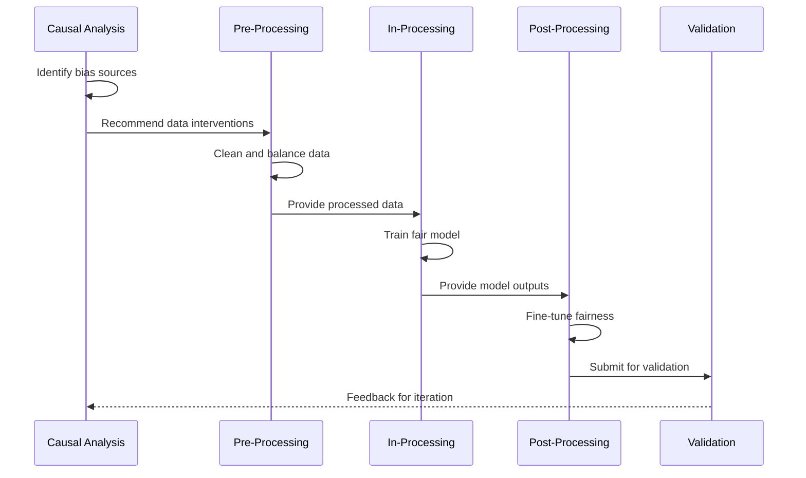

    E --> J[Apply All Four Toolkits]
    F --> K[Selective Multi-Stage]
    H --> L[Threshold + Calibration]
    I --> M[Score Transformation]
    
    J --> N[Comprehensive Evaluation]
    K --> N
    L --> N
    M --> N
```

### Stage 2: Technique Compatibility Matrix

| Pre-Processing | In-Processing | Post-Processing | Compatibility | Recommended |
|----------------|---------------|-----------------|---------------|-------------|
| **Statistical Parity** | **Adversarial** | **Threshold** | ✅ High | Multi-stage bias reduction |
| **Resampling** | **Regularization** | **Calibration** | ✅ High | Balanced, stable approach |
| **Feature Selection** | **Constraints** | **Transformation** | ⚠️ Medium | Careful feature coordination |
| **Synthetic Data** | **Multi-Objective** | **Rejection Option** | ✅ High | Comprehensive coverage |

### Stage 3: Integration Pathways

#### Pathway A: Maximum Effectiveness (Full Pipeline)
**When to Use**: New model development, high performance tolerance, sufficient resources

```python
class FullPipelineIntegration:
    def __init__(self):
        self.causal_analyzer = CausalFairnessAnalyzer()
        self.preprocessor = PreProcessingToolkit()
        self.inprocessor = InProcessingToolkit()
        self.postprocessor = PostProcessingToolkit()
        
    def integrate(self, data, model_config, fairness_goals):
        # Stage 1: Causal Analysis
        causal_results = self.causal_analyzer.analyze(data, fairness_goals)
        intervention_points = causal_results['intervention_points']
        
        # Stage 2: Pre-Processing (Data-level interventions)
        if 'data_bias' in intervention_points:
            processed_data = self.preprocessor.apply_interventions(
                data, causal_results['data_interventions']
            )
        else:
            processed_data = data
            
        # Stage 3: In-Processing (Training-level interventions)
        if 'training_bias' in intervention_points:
            fair_model = self.inprocessor.train_fair_model(
                processed_data, model_config, causal_results['training_interventions']
            )
        else:
            fair_model = train_baseline_model(processed_data, model_config)
            
        # Stage 4: Post-Processing (Output-level interventions)
        if 'output_bias' in intervention_points:
            final_predictions = self.postprocessor.apply_interventions(
                fair_model, processed_data, causal_results['output_interventions']
            )
        else:
            final_predictions = fair_model.predict(processed_data)
            
        return {
            'model': fair_model,
            'predictions': final_predictions,
            'intervention_log': self._create_intervention_log()
        }
```

#### Pathway B: Deployed Model Enhancement (Post-Processing Focus)
**When to Use**: Existing deployed models, regulatory constraints, quick implementation needed

```python
class DeployedModelIntegration:
    def __init__(self, existing_model):
        self.model = existing_model
        self.causal_analyzer = CausalFairnessAnalyzer()
        self.postprocessor = PostProcessingToolkit()
        
    def integrate(self, validation_data, fairness_goals):
        # Stage 1: Causal Analysis (Limited scope)
        causal_results = self.causal_analyzer.analyze_outputs(
            self.model, validation_data, fairness_goals
        )
        
        # Stage 2: Strategic Post-Processing
        intervention_plan = self._create_postprocessing_plan(causal_results)
        
        # Apply interventions in sequence
        enhanced_predictions = validation_data.copy()
        
        if intervention_plan['needs_calibration']:
            calibrator = self.postprocessor.get_calibrator(intervention_plan['calibration_type'])
            enhanced_predictions = calibrator.fit_transform(
                enhanced_predictions, validation_data['protected_attrs']
            )
            
        if intervention_plan['needs_threshold_adjustment']:
            threshold_optimizer = self.postprocessor.get_threshold_optimizer(
                intervention_plan['fairness_criterion']
            )
            enhanced_predictions = threshold_optimizer.fit_transform(
                enhanced_predictions, validation_data['labels'], 
                validation_data['protected_attrs']
            )
            
        if intervention_plan['needs_rejection_option']:
            rejection_classifier = self.postprocessor.get_rejection_classifier(
                intervention_plan['rejection_config']
            )
            enhanced_predictions = rejection_classifier.fit_transform(
                enhanced_predictions, validation_data['confidence'],
                validation_data['protected_attrs']
            )
        
        return enhanced_predictions, intervention_plan
```

#### Pathway C: Hybrid Approach (Selective Integration)
**When to Use**: Moderate constraints, specific fairness goals, iterative improvement

```python
class HybridIntegration:
    def __init__(self):
        self.toolkits = {
            'causal': CausalFairnessAnalyzer(),
            'preprocessing': PreProcessingToolkit(),
            'inprocessing': InProcessingToolkit(), 
            'postprocessing': PostProcessingToolkit()
        }
        
    def integrate(self, data, constraints, fairness_goals):
        # Dynamic integration based on constraints and effectiveness
        integration_plan = self._create_integration_plan(data, constraints, fairness_goals)
        
        results = {}
        current_data = data
        
        for stage in integration_plan['stages']:
            if stage['toolkit'] == 'causal':
                results['causal'] = self.toolkits['causal'].analyze(
                    current_data, stage['config']
                )
                
            elif stage['toolkit'] == 'preprocessing':
                current_data = self.toolkits['preprocessing'].apply_interventions(
                    current_data, stage['interventions']
                )
                results['preprocessing'] = stage['interventions']
                
            elif stage['toolkit'] == 'inprocessing' and constraints['can_retrain']:
                model = self.toolkits['inprocessing'].train_fair_model(
                    current_data, stage['model_config']
                )
                results['inprocessing'] = model
                
            elif stage['toolkit'] == 'postprocessing':
                if 'model' in results['inprocessing']:
                    predictions = self.toolkits['postprocessing'].enhance_predictions(
                        results['inprocessing']['model'], current_data, stage['config']
                    )
                else:
                    # Work with existing model
                    predictions = self.toolkits['postprocessing'].enhance_predictions(
                        constraints['existing_model'], current_data, stage['config']
                    )
                results['postprocessing'] = predictions
        
        return results
```

## 🔄 Integration Workflows

### Workflow 1: New Model Development



**Implementation:**

```python
def new_model_development_workflow(raw_data, fairness_requirements, business_constraints):
    """Complete workflow for developing new fair model"""
    
    # Phase 1: Causal Analysis
    causal_results = perform_causal_analysis(raw_data, fairness_requirements)
    
    # Phase 2: Data Preparation
    preprocessing_plan = create_preprocessing_plan(causal_results, raw_data)
    processed_data = apply_preprocessing(raw_data, preprocessing_plan)
    
    # Phase 3: Fair Model Training
    if business_constraints['performance_tolerance'] > 0.05:  # 5% tolerance
        training_plan = create_inprocessing_plan(causal_results, processed_data)
        model = train_fair_model(processed_data, training_plan)
    else:
        model = train_baseline_model(processed_data)
    
    # Phase 4: Output Adjustment
    postprocessing_plan = create_postprocessing_plan(
        model, processed_data, fairness_requirements, causal_results
    )
    final_system = apply_postprocessing(model, postprocessing_plan)
    
    # Phase 5: Validation
    validation_results = comprehensive_validation(
        final_system, processed_data, fairness_requirements
    )
    
    return final_system, validation_results
```

### Workflow 2: Legacy System Enhancement

```mermaid
sequenceDiagram
    participant Audit as Fairness Audit
    participant CA as Causal Analysis
    participant PostP as Post-Processing
    participant Deploy as Deployment
    participant Monitor as Monitoring
    
    Audit->>CA: Bias assessment results
    CA->>CA: Limited causal analysis
    CA->>PostP: Intervention recommendations
    PostP->>PostP: Apply corrections
    PostP# Integration Guide

> Orchestrate multiple fairness interventions for maximum effectiveness

## 🧭 Navigation
**Previous:** [Post-Processing Fairness Toolkit](./post-processing-toolkit.md) | **Next:** [Case Study](./case-study.md) | **Home:** [Main README](./README.md)

## 🎯 Overview

The Integration Guide provides a systematic approach to combining multiple fairness intervention techniques across the ML pipeline. Rather than applying interventions in isolation, this guide helps you orchestrate causal analysis, pre-processing, in-processing, and post-processing methods for optimal fairness outcomes.

## 🧠 Core Integration Principles

### 1. Sequential Enhancement
Each stage builds upon previous interventions rather than replacing them:
- **Causal Analysis** → Informs all subsequent interventions
- **Pre-Processing** → Cleans data for better training and post-processing
- **In-Processing** → Embeds fairness during training (when feasible)
- **Post-Processing** → Final adjustments for deployed models

### 2. Complementary Strengths
Different techniques address different aspects of bias:
- **Pre-Processing**: Data quality and representation issues
- **In-Processing**: Model learning dynamics and optimization
- **Post-Processing**: Decision boundaries and output interpretation

### 3. Constraint-Aware Selection
Integration strategy adapts to real-world constraints:
- **Technical Constraints**: Model access, computational resources, deployment environment
- **Business Constraints**: Performance requirements, regulatory compliance, timeline
- **Data Constraints**: Sample sizes, label quality, protected attribute availability

## 🗺️ Integration Decision Framework

### Stage 1: Constraint Assessment

```mermaid
flowchart TD
    A[Start Integration Planning] --> B{Can Retrain Model?}
    B -->|Yes| C{Performance Tolerance}
    B -->|No| D[Post-Processing Focus]
    
    C -->|High| E[Full Pipeline Integration]
    C -->|Low| F[Cautious Multi-Stage]
    
    D --> G{Protected Attributes Available?}
    G -->|Yes| H[Direct Post-Processing]
    G -->|No| I[Proxy-Based Methods]
    
    E