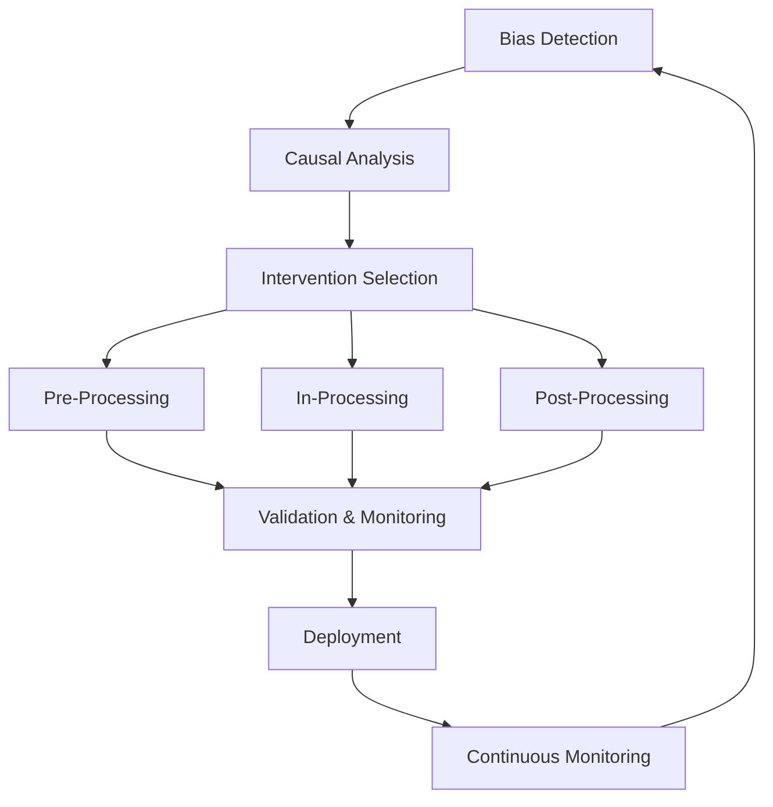

# Fairness Intervention Playbook
## A Comprehensive Guide for Implementing Fair AI Systems

### Executive Summary

This Fairness Intervention Playbook provides engineering teams with a systematic approach to diagnose and remediate bias in AI systems. It integrates causal analysis, data transformations, model constraints, and threshold adjustments into a coherent intervention strategy that can be applied across different domains and problem types.

### Problem Statement

Our organization's AI systems face increasing scrutiny regarding fairness, with incidents like gender disparities in loan approvals highlighting the need for systematic intervention approaches. Currently, teams use ad hoc methods to address bias, leading to inconsistent outcomes and potential regulatory risks. This playbook standardizes fairness interventions across all AI applications.

### Playbook Components

The playbook consists of four integrated toolkits:

1. **[Causal Fairness Toolkit](causal-fairness-toolkit.md)** - Identifies root causes of bias through causal modeling
2. **[Pre-Processing Fairness Toolkit](preprocessing-fairness-toolkit.md)** - Addresses bias at the data level
3. **[In-Processing Fairness Toolkit](inprocessing-fairness-toolkit.md)** - Embeds fairness constraints during model training
4. **[Post-Processing Fairness Toolkit](postprocessing-fairness-toolkit.md)** - Adjusts outputs for fair outcomes

### Workflow Overview

### Quick Start Guide

1. **Assess**: Use the [Implementation Guide](implementation-guide.md) to understand your current situation
2. **Analyze**: Apply the Causal Fairness Toolkit to identify bias mechanisms
3. **Intervene**: Select appropriate interventions using our decision frameworks
4. **Validate**: Use our validation framework to measure success
5. **Monitor**: Implement continuous fairness monitoring

### Case Study

See our [Loan Approval System Case Study](case-study.md) for a complete walkthrough of the playbook in action.

### Key Benefits

- **Systematic Approach**: Standardized methodology across all AI systems
- **Evidence-Based**: Grounded in causal analysis and scientific principles
- **Practical**: Designed for real-world engineering constraints
- **Scalable**: Adaptable across domains and problem types
- **Intersectional**: Considers overlapping identities and complex bias patterns

### Getting Started

1. Review the [Implementation Guide](implementation-guide.md) for setup instructions
2. Identify your specific use case and bias concerns
3. Follow the appropriate workflow based on your intervention needs
4. Use our templates and decision trees to guide implementation
5. Validate results using our comprehensive evaluation framework

---

*For questions or complex cases requiring expert consultation, contact the AI Ethics team.*