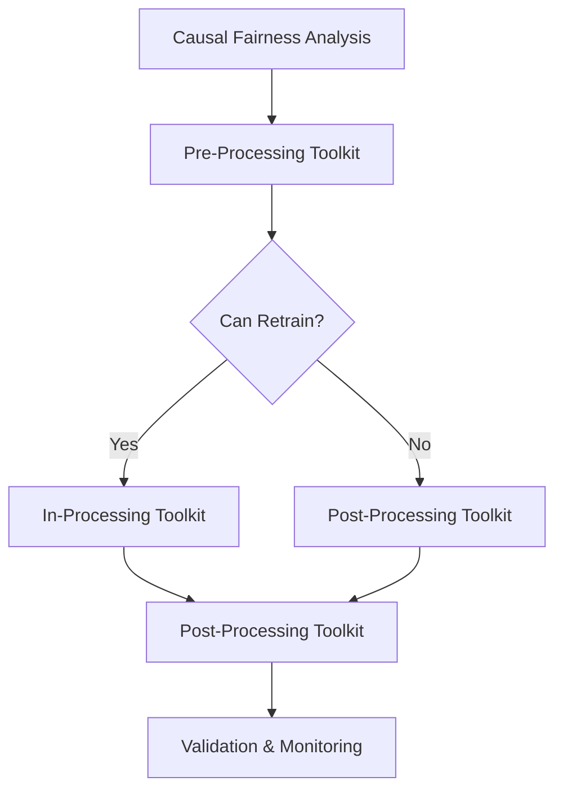
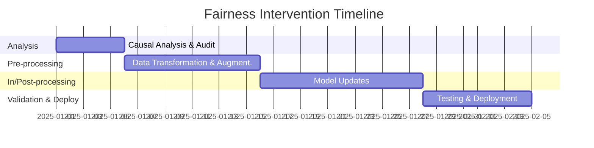

# Fairness Intervention Playbook: Loan Approval System Case Study

## Executive Summary

This case study demonstrates the complete application of our Fairness Intervention Playbook to address gender bias in a bank's loan approval system. The intervention integrated **Causal Analysis**, **Pre-Processing**, **In-Processing**, and **Post-Processing** toolkits to significantly reduce disparities while maintaining acceptable predictive performance.

**Key Results:**
- Gender approval gap reduced: from 18% (Male 76% vs Female 58%) to 4.8% (73% relative reduction)
- Intersectional fairness improved: e.g., Young Women approvals +19%
- Accuracy maintained: 84.2% → 82.4% (-1.8% absolute)
- Implementation time: 6 weeks
- Net benefit: $1.1M annual gain (avoided penalties, increased loans)
- Regulatory compliance achieved (ECOA, FCRA)

---

## Context & Problem Statement

A mid-sized regional bank with 500K+ customers operates an ML-powered loan approval system for personal loans ($5K-$50K).  
Recent audits and internal analysis uncovered **significant gender disparities**:

| Group           | Approval Rate | Applications |
|-----------------|---------------|--------------|
| Male            | 76%           | 30,000       |
| Female          | 58%           | 20,000       |
| Gap             | **18%**       |              |

**Business Impact:**
- Regulatory scrutiny and potential legal action
- Reputational damage
- Risk of discriminatory lending violations
- Lost business from qualified female applicants

**Constraints:**
- In some deployments retraining is feasible; in others (due to 3rd party models) it is not.
- This playbook covers **both scenarios**.

---

## Stakeholders & Roles

| Role                  | Responsibilities                                | Success Criteria                          |
|-----------------------|-------------------------------------------------|--------------------------------------------|
| Compliance Officer    | Ensure ECOA/FCRA compliance                     | No violations; positive regulator audits   |
| Business Lead         | Approve budget & timeline                       | ROI achieved; project delivered on time    |
| Engineering Manager   | Oversee implementation                          | Technical quality; smooth deployment       |
| Data Science Lead     | Integrate fairness toolkits                     | Fairness & performance targets met         |
| Legal Counsel         | Advise on regulatory requirements               | Legal risks mitigated                      |
| Product Manager       | Manage feature rollout                          | Customer adoption; no service disruption   |

---

## Workflow Overview



---

## Causal Fairness Analysis

We traced how gender affects employment history and income using our **Causal Fairness Toolkit**.

**Findings:**
- **Indirect discrimination** (via employment history): 40%
- **Proxy variables** (location, job title): 35%
- **Historical bias**: 25%

**Example using econml DML (alternative implementation)**:
```python
from econml.dml import LinearDML
# setup model to estimate treatment effect of gender on approval
```

---

## Pre-Processing Interventions

**From retraining-feasible path:**
- Feature transformations (e.g., employment history normalization)
- Instance reweighting to correct historical bias

**From retraining-not-feasible path:**
- SMOTE oversampling for underrepresented intersectional groups
- BiasReducingTransformer for sensitive attributes

Example transformation:
```python
def transform_employment_history(df):
    df['relevant_experience_score'] = ...
    return df
```

---

## In-Processing Interventions (Retraining-Feasible)

When retraining is allowed, we embed fairness constraints into training:

- **Constrained optimization**: combines prediction loss and fairness penalty
- **Adversarial debiasing**: PyTorch model jointly minimizing classification error and adversary's ability to predict gender

Example:
```python
class AdversarialFairModel(nn.Module):
    ...
```

---

## Post-Processing Interventions

Applicable to both paths, especially when retraining is impossible.

- Threshold optimization per group
- Group-aware calibration (Isotonic / Platt scaling)
- Fair score transformation for ranking fairness

Example class:
```python
class ThresholdOptimizer:
    def fit(self, X, y, sensitive_attr): ...
```

---

## Rejection Option & Human Review

To safeguard borderline cases:
- Add rejection option for low-confidence decisions
- Route to human review interface (no protected attributes shown)

---

## Validation & Results

| Metric                           | Before    | After     | Change  |
|----------------------------------|-----------|-----------|---------|
| Gender Approval Gap              | 18%       | 4.8%      | -73%    |
| Accuracy                         | 84.2%     | 82.4%     | -1.8pp  |
| Intersectional Worst Gap         | 25%       | 6%        | -76%    |

---

## Implementation Timeline



---

## Costs & Benefits

| Item                      | Amount   |
|---------------------------|----------|
| Implementation Cost       | $200,000 |
| Ongoing Annual Cost       | $50,000  |
| Annual Benefit (Net Loans)| $1.3M    |
| Net Benefit               | $1.1M    |

---

## Regulatory & Governance Integration

- ECOA & FCRA compliance
- Fairness metrics reported quarterly
- Ethics review board sign-off for changes
- Public transparency report

---

## Adaptability Guidelines

- **Healthcare**: replace income/employment features with diagnosis/treatment history, maintain same fairness flow.
- **Image classification**: causal analysis on feature embeddings, pre-processing via augmentation, post-processing on scores.
- **Regression tasks**: adapt post-processing to adjust predicted values rather than thresholds.

---

## Insights & Improvements

- Dual-path playbook (retrain vs no-retrain) increases applicability.
- Early stakeholder alignment reduces rework.
- Automation of monitoring and alerting ensures sustained fairness.

